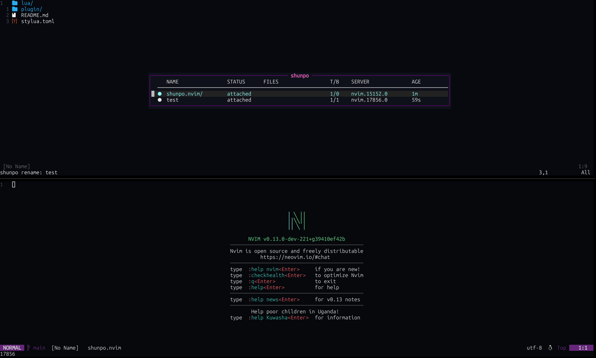

<div align="center">
  <h1>shunpo.nvim ⚡</h1>
   
</div>

Flash-step between running nvim instances. Detach here, reattach there.

Currently Windows only.

## Requirements

- Neovim v0.12.4+/nightly

## Install

### vim.pkg (Neovim 0.12+)

```lua
vim.pkg.add("github:sanzharkuandyk/shunpo.nvim")
require("shunpo").setup({})
```

### Lazy

```lua
{
  "SanzharKuandyk/shunpo.nvim",
  opts = {},
}
```

## Commands

Hooks into nvim's built-in `:detach` / `:connect` / `:restart`.

| Command | Action |
|---|---|
| `:Shunpo` | Open instance list |
| `:ShunpoNext` | Swap UI to next instance |
| `:ShunpoPrev` | Swap UI to previous instance |

## List keymaps

| Key | Action |
|---|---|
| `<CR>` | Swap UI to instance |
| `d` | Detach selected instance |
| `%d` | Detach all other UIs from the selected instance (`:%detach`) |
| `x` | Kill remote instance |
| `i` | Rename instance |
| `r` | Refresh list |
| `R` | Restart instance through Neovim's `ZR` behavior (preserves session) |
| `1R`–`8R` | Count-aware `ZR` restart without restoring the session |
| `9R` | Count-aware `ZR` restart without restoring the session or checking changes |
| `q` / `<Esc>` | Close |

## Lualine

```lua
lualine_c = {
  function()
    return require("shunpo").lualine({
      fallback = vim.fn.fnamemodify(vim.fn.getcwd(), ":t"),
    })
  end,
}
```

## Config

```lua
require("shunpo").setup({
  window = {
    width = nil,                      -- nil fits the rendered columns; fraction or absolute columns also work
    height = nil,                     -- nil fits the rows; fraction or absolute rows also work
    border = "rounded",               -- any nvim_open_win border style
    title = " shunpo ",               -- float title
  },
  registry = {
    dir = nil,                        -- override instances dir (default: stdpath("data")/shunpo/instances)
  },
  list = {
    include_self = false,             -- show current instance in the list
    fetch_meta = true,                -- show tabs/bufs/cwd published by each instance
    prune_on_open = true,             -- drop entries whose process is no longer alive
    -- detached_only = false,         -- hide attached instances (commented: off by default)
    autorefresh = true,               -- re-render list on a timer
    autorefresh_period = 500,         -- refresh interval in ms
  },
  swap = {
    kill_on_no_ui = false,            -- :connect! — kill source server if it has no UIs left
  },
  keymaps = {
    swap = "<CR>",                    -- swap UI to the selected instance
    detach_self = "d",                -- :detach on the selected instance
    detach_others = "%d",             -- :%detach on the selected instance (when supported by Nvim)
    kill_remote = "x",                -- :qall! on selected instance
    rename = "i",                     -- rename selected instance (vim.ui.input)
    refresh = "r",                    -- rebuild list
    restart = "R",                    -- count-aware :restart on selected instance (preserves name)
    close = { "q", "<Esc>" },
    next = {},                        -- jump cursor to next row (unbound by default)
    prev = {},                        -- jump cursor to prev row (unbound by default)
  },
  autocmds = {
    register_on_vimenter = true,      -- write registry entry on VimEnter
    update_on_dirchanged = true,      -- refresh entry when cwd changes
  },
})
```
